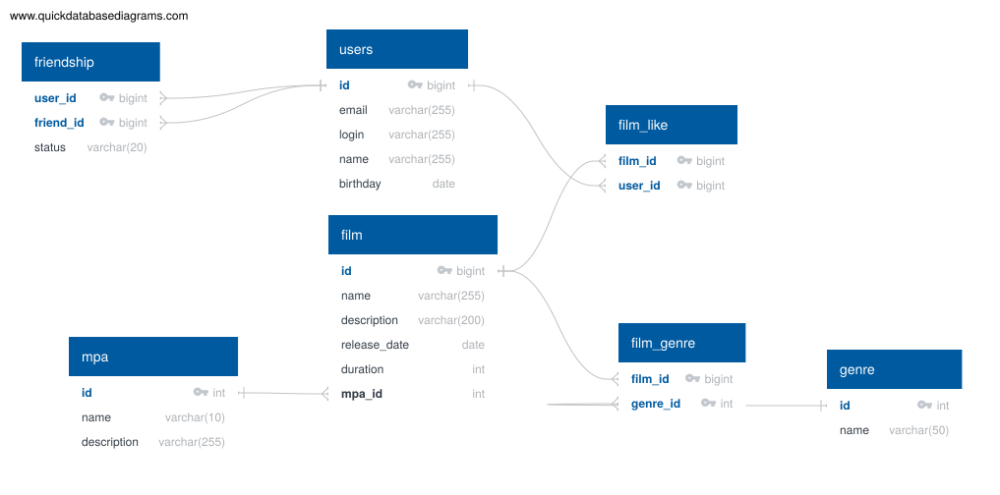

# java-filmorate

## Схема базы данных



### Описание таблиц

- **users** - пользователи: email, логин, имя, дата рождения.
- **friendship** - дружба между пользователями. `user_id` - кто отправил заявку, `friend_id` - кого пригласили, `status` - `UNCONFIRMED` или `CONFIRMED`.
- **film** - фильмы: название, описание, дата релиза, длительность и ссылка на рейтинг MPA.
- **mpa** - справочник возрастных рейтингов: G, PG, PG-13, R, NC-17.
- **genre** - справочник жанров.
- **film_genre** - связь фильмов и жанров, у фильма их может быть несколько.
- **film_like** - лайки пользователей.

## Примеры запросов

Справочные данные:

```sql
INSERT INTO mpa (id, name) VALUES
(1, 'G'), (2, 'PG'), (3, 'PG-13'), (4, 'R'), (5, 'NC-17');

INSERT INTO genre (id, name) VALUES
(1, 'Комедия'), (2, 'Драма'), (3, 'Мультфильм'),
(4, 'Триллер'), (5, 'Документальный'), (6, 'Боевик');
```

Все фильмы:

```sql
SELECT * FROM film;
```

Все пользователи:

```sql
SELECT * FROM users;
```

Фильм по id:

```sql
SELECT * FROM film WHERE id = 1;
```

Пользователь по id:

```sql
SELECT * FROM users WHERE id = 1;
```

Топ-10 популярных фильмов:

```sql
SELECT f.name,
       COUNT(fl.user_id) AS likes_count
FROM film AS f
LEFT JOIN film_like AS fl ON fl.film_id = f.id
GROUP BY f.id, f.name
ORDER BY likes_count DESC
LIMIT 10;
```

Жанры фильма:

```sql
SELECT g.name
FROM film_genre AS fg
JOIN genre AS g ON g.id = fg.genre_id
WHERE fg.film_id = 1;
```

Поставить лайк:

```sql
INSERT INTO film_like (film_id, user_id) VALUES (1, 1);
```

Убрать лайк:

```sql
DELETE FROM film_like WHERE film_id = 1 AND user_id = 1;
```

Отправить заявку в друзья:

```sql
INSERT INTO friendship (user_id, friend_id, status)
VALUES (1, 2, 'UNCONFIRMED');
```

Подтвердить дружбу:

```sql
UPDATE friendship
SET status = 'CONFIRMED'
WHERE user_id = 1 AND friend_id = 2;
```

Список друзей пользователя:

```sql
SELECT u.*
FROM users AS u
JOIN friendship AS f
  ON (f.user_id = 1 AND u.id = f.friend_id)
  OR (f.friend_id = 1 AND u.id = f.user_id AND f.status = 'CONFIRMED');
```

Общие друзья двух пользователей:

```sql
SELECT u.*
FROM friendship AS f1
JOIN friendship AS f2 ON f1.friend_id = f2.friend_id
JOIN users AS u ON u.id = f1.friend_id
WHERE f1.user_id = 1 AND f2.user_id = 2;
```
